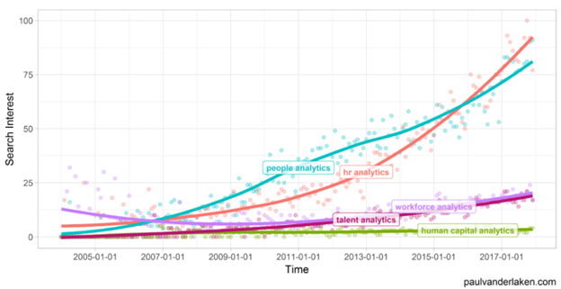

# HR analytics – Understanding the Power of Big Data

## Introduction

>“In God we trust. All others must bring data”.

Apparently, William Edward Deming couldn’t stress enough the importance of big data when doing business. And he was right – today, data means knowledge and power. You just need to know how to interpret and use it correctly.

Data analysis has been integrated into numerous departments within organizations, one of which is the HR (Human Resources), where it helps the HRM (Human Resource Management) make the right decisions, which is crucial for the organizations’ growth.

The statement that HR is one of the most important parts of an organization comes as no surprise, but what exactly makes it so important? And what does data have to do with it?

Keep on reading to find out!

## Why is HR so Important?

It is a well-known fact that the employees are the most important asset to any organization since the growth and overall success of a company are greatly determined by the productivity and efficiency of its workers. Therefore, choosing the right people and knowing how to manage them is one of the most crucial, yet challenging tasks that fall on the shoulders of the HR team.

The statement that the hiring process is of foremost significance can be backed up with numbers – in a [survey](http://press.careerbuilder.com/2015-07-07-CareerBuilder-Survey-Reveals-New-Era-in-CEO-Human-Resources-Relationship) conducted by CareerBuilder in 2015, 48 percent of the CEOs admitted to losing money due to inefficient recruitment.

For a long time, it was believed that people can’t be measured in numbers, thus leaving no place for computers and mathematics in the HRM. Moreover, HR professionals wanted to rely merely on their bare instincts when making decisions. But as Thomas H. Davenport, a distinguished Professor at Babson College and Research Fellow, says,

>“Trusting your gut on people issues turns out to be a bad idea.”

So, as the popularity of data-driven approaches in various segments of modern living has grown, people figured out that using the data that is available at their fingertips for making HR-based decisions would be immensely beneficial. And that’s when HR analytics was brought to the table.

Today, it is clear that the future of HR lies in data-driven decision-making processes.

## Different Types of Analytics Used in HR

Generally speaking, analytics is defined as the discovery, interpretation, and communication of data patterns that aid decision-making and performance improvement. It uses data and math to answer questions, predict future happenings and outcomes, and discover relationships.

Analytics is everywhere and is utilized for various processes ranging from day-to-day choices to big companies’ complex business resolutions. When it comes to statistical analysis of people data within an organization, there exist several different terms that are often interchangeably used but are rather different:

- **HR analytics** - it particularly deals with the HR metrics such as turnover, cost-per-hire, benefits participation rate, **absenteeism,** and others. These metrics play a key role in measuring the effectiveness of a company’s human resources initiatives.
- **People analytics** – it is generally used as a synonym for HR analytics, yet it has a broader definition. Namely, as the name suggests, people analytics refers to the “people” in general. That means that, apart from the employees, the analytics is applicable for the customers as well.
- **Workforce analytics** – this term is again used as a synonym for HR analytics. However, its application goes beyond HR and is integrated into other areas of a business, therefore can be measured by any function and department, across teams, and by employees themselves.

The figure depicts the interest for the specific terms over time, measured by the number of Google searches. Talent analytics and human capital analytics are basically the same things as HR analytics, but they have never gained much popularity.

On the other hand, it can be noted that the term HR analytics was a real buzzword in 2017, and continues to be so even more in 2021.

## A Deep-Dive Into HR Analytics

By now, we have understood that HR analytics is a fast-growing trend that is more and more adopted by both startups and large corporations. Yet we still haven’t given a detailed definition and explanation about what HR analytics actually is.

So, **HR analytics** is a people-oriented process of collecting, modeling, and analyzing human resource (HR) data in order to improve an organization’s outcomes and workforce performance.

### The Power of Data

Carly Fiorina, an American businesswoman, said:

>“The goal is to turn data into information, and information into insight.”

Even though most organizations collect data on a daily basis, this data is raw and as such cannot give any valuable insight.

So, In order for the data to become information, it has to be modified. Generally speaking, the data becomes meaningful once it has been processed, i.e. edited, cleaned, modified, and organized.

The processed data then has to be interpreted and analyzed correctly in order to supply the HR team with vital information that would allow them to purposefully contribute to the organization’s bottom line and make calculated decisions for the future.

Most of the time, the data has all the answers, all we need to do is ask the right questions. But what are the ‘right questions’ that will enlighten you and thus, help you make informed and calculated decisions? Let’s explore a few of them:

- What can we do to foster greater levels of innovation?
- Does our performance rating system accurately reflect actual employee performance?
- Why are so many of our new hires leaving within the first few months?
- How can we reduce employee absenteeism?
- How long does it take to hire employees?
- Which of our employees are most likely to leave within the year?

### Which Analytics are Good Analytics?

You can’t provide just any analytics and expect it to be helpful for the organization.

In fact, good analytics should be:

- **Sustainable** – the quality of data is of the utmost importance
- **Relevant** – the data should be applied directly to the concrete business issue
- **Eye-catching** – presenting raw numbers just isn’t enough. HR analysts should be able to deliver a compelling story that is easy to comprehend
- **Transformative** – the analytics should be convincing enough to make a CEO change his/her mind

### The Process of HR Analytics

How does HR analytics work? How do we start from raw data and get to data-driven decision-making?

The steps in the process are:

- **Collect the data**
- **Measure the data**
- **Analyze the data**
- **Apply the findings to make business decisions**

Now let us take a closer look at each one of the aforementioned steps:

#### 1. Collecting Data

The first essential component for conducting any kind of analysis is _data._ That’s why the first step in the HR analysis process is to track and collect high-quality data.

There exist two main [types of data sources](https://www.analyticsinhr.com/blog/what-is-hr-analytics/): internal and external.

Internal data sources contain demographic data, performance data, payroll data, engagement data, turnover data, etc.

External data sources contain population data, labor market data, social media data, etc.

Data is collected from both external and internal sources, regarding their relevance for the particular issue.

#### 2. Measuring Data

In order to draw conclusions about the past and the future, we have to go through a continuous process of data measurement and comparison.

Therefore, at this point, we need to define a clear-cut baseline so that current data can be compared to it. How can an organization know if the time needed for hiring a new person is too long or too short if they haven’t set a concrete time boundaries?

HR Metrics are extremely beneficial and valuable, and this can be backed up with numbers – according to a [recent survey](https://www.bamboohr.com/resources/infographics/what-your-executive-team-wants-from-hr-reports/), 82% of executives say that HR metrics are somewhat useful, useful, or extremely useful for their organization.

A detailed definition and explanation of some of the most important HR Metrics can be read in the next section.

#### 3. Analyzing Data

In this stage, we review the results obtained from the previous stage and use these metrics to identify impactful trends and patterns.

In order to get the desired outcomes, three main types of analytical methods are used, depending on the requirements:

- [Descriptive analytics](https://www.valamis.com/hub/descriptive-analytics) – a statistical method that is used for identifying patterns or meaning by finding and outlining historical data
- [Prescriptive analytics](https://www.valamis.com/hub/prescriptive-analytics) – a statistical method that is used for generating recommendations and making decisions by utilizing the findings of algorithmic models.
- [Predictive analytics](https://www.valamis.com/hub/predictive-analytics) – a statistical method that is used for identifying trends and predicting future behaviors by exploiting machine learning and algorithms.

#### 4. Application

This is the final stage in which the findings are applied within the organization in order to make insightful data-driven decisions.

As we have previously mentioned, the analytics should be clear, visually appealing, and easy to understand to the extent that they will be able to make the executives reconsider their business choices and resolutions.

### The Levels of HR Analytics

Organizations differ greatly in their approach to HR analytics and the extent to which they use their people data. According to Josh Bersin's concept, four levels of [HR analytics "maturity"](https://www.hranalytics.com.au/hr-analytics-blogs-articles-guides/your-hr-analytics-maturity-taking-it-to-the-next-level) are commonly distinguished:

- **Operational Reporting** – it is descriptive reporting that reflects the current state of a variety of HR metrics. Operational reporting usually uses only HR data and gives current information and sometimes - historical reporting. Generally, it has a low total value to the organization
- **Advanced Reporting** – it is once again descriptive reporting but in more detail. It uses the same data as the operational reporting, but with creates some extra reports considering trends and progress towards goals. It still reports on current or past situations, but it might provide valuable insights for making decisions. Advanced reporting is a must for most organizations.
- **Advanced Analytics** – at this level, data is being used for solving issues. So, the data from the previous two levels is statistically analyzed in such a manner that it discovers patterns, trends, successes, and failures that can help in solving business challenges.
- **Predictive Analytics** - predictive models and machine learning algorithms are used to simulate numerous scenarios and develop optimal solutions using data from lower levels. At this maturity level, several data sources from HR and the company are used, and the goal of predictive HR is to anticipate and meet strategic business needs with data-driven decisions.

## Key HR Metrics

Using numbers is the best way to interpret the data we have collected and draw calculated conclusions.

_“What gets measured gets improved”_, [said Peter Drucker](https://www.entrepreneur.com/slideshow/299936). And he couldn’t be more right – HR metrics are a must for every decent HR team.

### What are HR Metrics?

HR metrics are key figures that measure the effectiveness of HR actions and initiatives.

They help in tracking the organization’s human capital and creating a purposeful strategy.

In fact, according to [this study](https://www.bamboohr.com/resources/infographics/what-your-executive-team-wants-from-hr-reports/), full 87 percent of respondents argue that HR reports influence their organization’s strategy to varying degrees.

### What are the Most Important HR Metrics?

The list of things that can be measured in HR is endless; however, not all of them give valuable insights that would make the company grow and succeed.

The decision on which HR metrics you should measure depends mainly on the organization’s size, priority, HR team, resolution, current issues, etc. However, there exist several metrics which are of the utmost importance and play a vital role in almost any organization.

Let’s go over some of the essential HR metrics, which are [classified](https://www.bamboohr.com/blog/key-hr-metrics/#:~:text=HR%20metrics%2C%20or%20human%20resources,into%20more%20of%20them%20later%29.) into a few distinct groups:

#### Recruitment

- **Time to Hire** – the average number of days between when a position is listed and when an applicant accepts your offer
- **Cost per Hire** – the average total cost of hiring a person, regarding both internal and external costs
- **Demographics** – the age, gender, education level, length of service, and other important characteristics of the employees
- **Headcount** – the total number of people employed in the organization’s department you are tracking

#### Time Tracking

- **Absence Rate** – also known as absenteeism. The number of days that an employee is absent over a given period of time
- **Overtime Hours** – the average number of overtime hours worked by all employees, or by a specific employee, over a given period of time

#### Engagement and Retention

- **Total Turnover Rate** – the average number of employees that leave the organization within a given time period. Moreover, the voluntary vs involuntary turnovers can be measured
- **Retention Rate** – this is the opposite of the turnover rate, i.e. it measures the number of employees who have remained in the company within a given time period
- **Employee Satisfaction** – this can be measured by the percentage of employees who would recommend the company they work at as a good working place.

#### Employee Value and Performance

- **Employee performance** – this can be measured by peer reviews, self-assessments, and manager assessments.
- **Revenue per employee** – the average amount of revenue per employee
- **Company performance** – this is measured as a ratio between the employee performance versus their feeling of engagement and value.

#### Training and Development

- **Training Completion Rate** – the number of employees who have completed a given training
- **Training Expenses** – the average cost of the training programs and courses per employee
- **Time to Completion** – the average time needed for a person to finish a specific training program

#### HR Service and Software

- **Cost of HR per Employee** – the average amount that the organization spends on HR, calculated by dividing the total expenses by the number of employees
- **ROI of HR Software** – ROI stands for Return On Investment and it can be roughly calculated as the difference between the costs for creating the software and the amount of money it generates.

### How to Use HR Metrics

The first thing to keep in mind is: _strive for quality, not quantity_.

That means that producing lots of data and measuring it doesn’t inherently promise beneficial insights. So, in order to not get flooded with useless metrics, be careful to only look at data that is relevant for the problem you want to solve.

Another thing to take into account is that the main purpose of the HR metrics is to be informative to such an extent that they would influence some larger-scale decisions. So, if they don’t do that, it’s time to reconsider and adjust your strategy.

Moreover, not all metrics are important for all teams and departments. So, for each HR metric, you should determine who the target audience is.

Last but not least, it’s crucial for the organization to clearly define its aims and objectives. There is no universally accepted formula for determining the “goodness” of your metrics. So, the organization should create its own goals for the metrics that portray its growth and overall success.

## HR Analytics in the Hiring Process

The intricate hiring process is prone to numerous mistakes. In fact, [74% of the employers surveyed by CareerBuilder](http://press.careerbuilder.com/2015-07-07-CareerBuilder-Survey-Reveals-New-Era-in-CEO-Human-Resources-Relationship) admitted to hiring the wrong person for a job at least once. These mistakes are quite costly – approximately $15,000 is lost for every bad hire.

So, the obvious conclusion is that new methods should be implemented within the recruitment process which would make it more efficient and resilient to error, and one of them is HR analytics. By using analysis, HR professionals will learn the type of talent, background, skills, and experience needed for each position in the company.

### What Can HR Analytics Tell Us?

Data can be used in order to draw conclusions and make data-driven decisions based on past experience. More specifically, you could learn many things from observing historical data, such as what are the most desirable attributes that new employees should have, or should you hire only those job candidates who have certain types of college degrees. So, HR analytics can:

- Enable fast candidate data collection
- Recognize candidates that have similar attributes with top-performing employees
- Provide equal opportunity and avoid bias by removing subjective opinions of the recruiters
- Enable better long-term hiring plans based on past data that gives insights into periods of over-hiring or under-hiring
- Better understand the candidates’ cultural fit and developmental opportunities.
- Use past experience to create various metrics that would enable the department to be more prepared for future hires, such as the timeframe for hiring specific roles within the organization

The possibilities of analytics are just endless. And they definitely help in understanding the perfect profile for a certain job.

But even if you know exactly what you are looking for, sifting through hundreds of resumes and motivational letters is a very time-consuming and tiring process.

And even if you do have the time to do it, statistics claim that [58% of hiring managers have caught a lie on a resume](http://press.careerbuilder.com/2014-08-07-Fifty-eight-Percent-of-Employers-Have-Caught-a-Lie-on-a-Resume-According-to-a-New-CareerBuilder-Survey), so there is still no way of knowing if interviewing that person would be a waste of time.

And even if they do not lie, there are many other necessary qualities needed for a person to be a good fit apart from their technical skills, like a positive attitude and great teamwork skills. Overall, the person has to be able to match with the organization’s work culture and get along with other employees.

That’s why looking at their CV, or even using good analytics tools such as Tableau or Power BI is usually insufficient for making a hiring decision.

But what else could you do? The answer is easy – _assessment testing!_

## Why is Assessment Testing Useful in Recruitment?

Assessment testing is a simple way to avoid making a bad hire by ensuring that the candidates really do have the required skills for the specific job position.

In fact, assessment tests, also known as pre-hire tests, should be used at the beginning of the recruitment process, even before you go through the resumes. Why?

Because that way, you save yourself the trouble of conducting countless interviews with unsuitable candidates that have provided misleading information about their capabilities in their resumes.

Let’s look at what statistics have to say about assessment testing:

- **Skills Gaps** - According to [recent research](https://www.shrm.org/hr-today/trends-and-forecasting/research-and-surveys/pages/skills-gap-2019.aspx), 75% of HR professionals who reported difficulty recruiting in the past 12 months say there are skills gaps in job candidates. Skill assignment tests can show whether candidates are able to quickly learn new things and upgrade their existing skills.
- **Reduce Turnover** – Companies that use pre-hire screenings report a 39% lower turnover rate. This statement is based on [research](https://www.aberdeen.com/hcm-essentials/the-pros-and-cons-of-pre-employment-screenings/) about the pros and cons of pre-employment screening conducted by the Aberdeen Group.
- **Higher Hire Manager Satisfaction** – another [research](https://www.concordconsulting.com/wp-content/uploads/2018/07/Pre-Hire_Assessments-AberdeenGroup.pdf) also conducted by Aberdeen Group shows that businesses which use pre-hire assessments are 36% more likely to be satisfied with their new hires than those who don’t.
- **Higher Employee Performance** – This [study](https://www.concordconsulting.com/wp-content/uploads/2018/07/Pre-Hire_Assessments-AberdeenGroup.pdf) reveals that companies that use pre-hire tests have a 24% higher likelihood of having employees who exceed expected performance goals.

By now, you are probably utterly convinced that using assessment testing in recruitment is the way to go. So, if you are looking for a simple and efficient tool to get you started, [TestGorilla](https://www.testgorilla.com/) offers you exactly that!

### Types of Assessment Tests

At TestGorilla, we have a broad palette of distinct types of tests that evaluate the candidate’s soft _and_ hard skills.

Choosing the right tests for the defined position is the first essential step in getting the needed results. The available [types of tests](https://www.testgorilla.com/blog/7-test-types-for-a-pre-employment-assessment/) are:

- [**Personality and Culture Fit**](https://www.testgorilla.com/blog/how-to-use-personality-tests/) – find out the core beliefs, values, interests, and behaviors of the candidate and see if they align with the company’s values. Moreover, gauge applicants’ work ethic, workplace personality, and workplace skills
- [**Cognitive Ability**](https://www.testgorilla.com/blog/cognitive-ability-tests-the-ultimate-guide-for-recruiters/) - measure the mental abilities of the candidate over various categories like attention to detail, critical thinking, problem-solving, numerical reasoning, and reading comprehension. They estimate applicants' potential to use mental processes to solve work-related problems
- [**Language**](https://www.testgorilla.com/blog/how-to-test-for-language-proficiency/) _–_ check if the candidate has the needed language knowledge for a certain position
- **Situational Judgment** – test a specific set of job competencies: leadership, resilience, planning and organizing, communicating, influencing, and decision-making. Informally said, these tests determine how that person will behave in a given situation.
- **Role-Specific Skills** – measure the skills needed for the specific job position, but in a more technical and knowledge-based manner.
- **Programming Skills** – measure the technical knowledge, but specifically in the domain of programming. There exist separate tests for different programming languages and frameworks.
- **Software Skills** – similar to programming skills tests, but these tests are focused more on computing platforms, cloud solutions such as HubSpot, GCP**,** and Zendesk, as well as traditional programs such as MS Word, MS Excel, and MS PowerPoint.

## Why Utilize TestGorilla

With TestGorilla, assessment testing is a piece of cake. And the most important part is - you can rank your candidates based on real data, instead of a gut feeling.

We help you find the most appropriate tests for the required job position, but you can also get personal and create your own custom questions in order to uniquely get to know your candidates.

After creating the assessments, send them to all the applicants with just one click, and wait for the results to roll in.

You get _real-time_ scores, so you can _compare_ the applicants immediately and get to know them in more detail by exploring their reports and watching their personalized videos.

Here’s what else TestGorilla brings to the table:

- **Cheating prevention**
- **Uncomplicated and easy to use**
- **Great value for money**
- **Mobile-friendly**
- **24/7 customer support**
- **Pleasing candidate experience**

_TestGorilla helps you make data-driven decisions that will advance your business in the long run._

## Benefits of HR Analysis

It was already mentioned countless times throughout this article that HR analytics should and must be a vital part of the decision-making processes in the HRM department of a company. HR analytics help in gathering valuable insights and can become predictive over time.

Apart from improved recruitment, a business can benefit from HR analytics in many different employee-based, as well as company-based segments.

Let’s dig into some of the greatest HR analytics benefits:

### Improve Employee Engagement

You don’t have to be a rocket scientist to know that having happy employees is vital for the survival of any business. Yet, if we take a look at the numbers, it seems as we still have a long way to go - [79% of people who quit their jobs cite ‘lack of appreciation’ as their reason for leaving](https://www.nbcnews.com/better/lifestyle/here-s-no-1-reason-why-employees-quit-their-jobs-ncna1020031https:/www.octanner.com/content/dam/oc-tanner/documents/global-research/White_Paper_Performance_Accelerated.pdf). However, CEOs are starting to get the memo and are increasingly using HR analytics as a powerful tool for increasing employees’ satisfaction.

Namely, Jennifer Frieman, a chief talent officer at Momentum Worldwide says:

>“We truly are on the brink of being able to leverage AI and HR analytics to understand how people are feeling to ensure we are adapting work environments to support individual experience and optimize support to drive better performance.”

### Change the Company Culture

Company culture is a set of various goals, values, practices, and attitudes that identify an organization. Maintaining a positive culture is one of the main factors in creating a healthy work environment. So, what characterizes the organization’s culture? Where should you seek improvement? You can use HR analysis to get the answers!

By collecting and processing data, organizations can build the cultures they want. More concretely, they can identify different personalities and use the information to customize the approaches.

### Prevent High Turnover

Employee turnover is loosely defined as the loss of talent in the workforce during a specific period of time. It has a direct impact on the company’s profitability and revenue in many ways, some of which are immediate and obvious, while some are long-term and subtle. A few of the possible negative effects of a high turnover rate are reduced business performance, increased training costs, poor workspace morale, deteriorating service quality, and reduction in ROI (return of investments).

For the aforementioned reasons, it is extremely important for companies to find a way to prevent a high turnover rate. And here’s where HR analytics can help!

How? Well, it can:

- Identify trends and patterns on why employees quit based on analysis of past data
- Help create a predictive model that would track the employees who fall within the identified patterns
- Understand the status of an employee by analyzing his/her productivity and engagement
- Improve the engagement level and work environment with various strategies
- Increase staff performance

Employee performance refers to the efficiency, effectiveness, and quality of work that the person delivers on the job. Once the employees are feeling respected and appreciated, their performance improves. By using HR analytics, employers can now understand what motivates their staff, as well as what blocks them from using their full potential. As Gareth Paine, an Associate Partner at EY, argues:

>“The insights collected by data and analytics go further than just tracking performance and evaluating motivation. It can be used to identify and forecast a low-performing employee. The data can be analyzed to identify patterns and a plan can be implemented to improve performance.”

### Boost Employee Development

Employee development is the process in which the employees of a company improve their skills and technical knowledge by going through some professional training. There exists a huge positive correlation between the expertise of the employees and the overall success of the business. However, the time needed and the learning method differ from person to person, and a failure to understand what approach every employee needs inherently leads to wasting both time and money. For that reason, the HR team uses HR analytics for getting answers to some important questions such as:

- What type of learning best fits the candidate (on-the-job vs classroom)?
- Which employees tend to be most likely to seek additional learning?
- Is your current staff development plan working or you need to change it a bit?

## The Future of HR Analytics

It is as clear as day that data analytics and artificial intelligence aren’t going anywhere. So, after hundreds of years of relying on their gut instincts, now HR specialists are relying more and more on data when making decisions and managing people.

However, there’s still a long way to go. In fact, a [recent study](https://www.fosway.com/wp-content/uploads/2018/10/Fosway-Group-Is-HR-fit-for-the-future-Oct18.pdfFosway%20Group) conducted by Fosway Group shows that 50% of HR professionals across Europe are not satisfied with how HR analytics is prioritized within the industry at this moment, while only 9% are very satisfied.

According to this study, 95% of the surveyed executives have agreed that high-quality data and analytics are crucial for the future success of the organization.

Moreover, 76% of the companies are planning to increase the overall investment in HR technology.

These numbers clearly underline the fact that HR analytics is progressively establishing itself in the mainstream of the business world and becoming an irreplaceable piece of the puzzle.

What are the key drivers for investing in HR analytics? According to the participants of the above-mentioned survey:

- To become a stronger and more strategic business partner (76%)
- To identify key talent and enhance the talent pipeline (62%)
- To optimize service quality and provision (58%)
- To enable better leadership and management (58%)

Considering these survey results, as well as the fast-paced technological advancement, it is hardly surprising that the field of HR analytics is expected to grow quickly in the future. As a matter of fact, the HR analytics market is predicted to grow from $1.9 billion in 2019 to $3.6 billion in just [four years](https://www.marketsandmarkets.com/Market-Reports/hr-analytics-market-94472004.html).

However, AI could never fully replace the HR teams to such an extent that they become redundant. So, the only thing that is bound to happen is the shift of the HR professionals’ responsibilities and tasks. That means that they will no longer be focused on the administrative part of the people management and will instead focus on the bigger picture, helping the organization meet its goals.

All in all, even though it is difficult to overestimate the power of big data, we must understand that data is useless if we don’t know what to do with it or how to interpret it.

That’s why the success of the HR department lies in knowing how to balance between experience and technology.

## Key Takeaways

### What is HR analytics?

HR analytics is a people-oriented method of gathering, modeling, and analyzing HR data in order to enhance an organization's results and workforce performance.

### What is the process of HR analytics?

There exist four main steps in the HR analytics process: _Collecting the data, measuring the data, analyzing the data, and applying the results_ for the purpose of making calculated and proactive business decisions.

### What are the main HR metrics?

HR metrics aid in the tracking of the organization's human capital and the development of a strategic plan and are crucial indicators used to assess the efficacy of HR actions and initiatives.

There exist countless HR metrics, but the most frequently used ones are separated into a few distinct categories:

- Recruitment (time to hire, cost per hire, demographics, headcount)
- Time tracking (absence rate, overtime rate)
- Engagement and retention (total turnover rate, retention rate, employee satisfaction)
- Employee value and performance (employee performance, revenue per employee, company performance)
- Training and development (training completion rate, training expenses, time to completion)
- HR service and software (cost of HR per employee, ROI of HR software)

### Why do we need HR analytics in recruitment?

A majority of the CEOs have admitted to making many mistakes when employing new people, and these mistakes are very costly. So, by using analytics in the hiring process, the chance of error is drastically lowered. HR experts use HR analytics in order to be able to determine the sort of talent, background, abilities, and experience required for each position in the company. More specifically, HR analytics help in collecting high-quality data, providing a bias-free hiring process, understanding the cultural fit of the candidate, making better long-term hiring plans, etc.

### What are assessment tests and why should they be used?

Assessment tests are tests that are being used in the hiring process, ideally at the beginning of it, for the purpose of determining the candidate’s fit for the specific job position. There exist several different types of tests that focus on both hard and soft skills.

Assessment tests should be used because they provide a quick, easy, and bias-free way of getting to know the job applicants’ skills, beliefs, values, interests,

### What are the benefits of HR analytics?

The HR analytics market is growing rapidly on a daily basis due to the huge positive impact it has on the organizations’ decision-making processes in the field of human resource management. Some of the key benefits of utilizing HR analytics within HRM are positive changes in the company culture, prevention of high turnover, increment of staff performance, and enhancement of employee development.