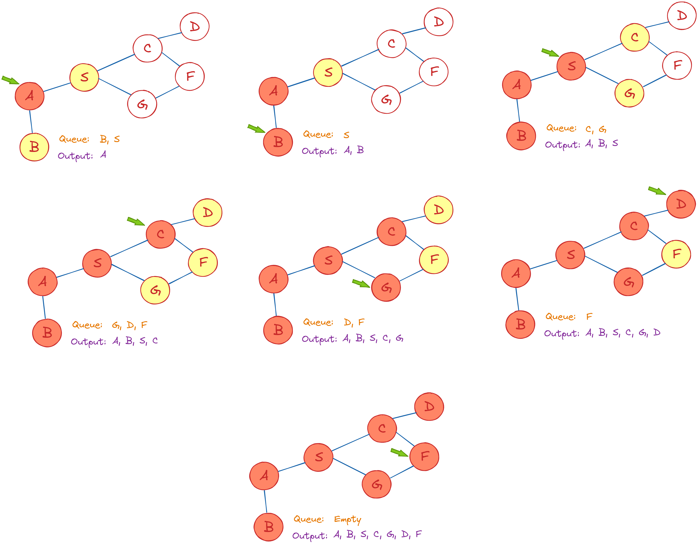
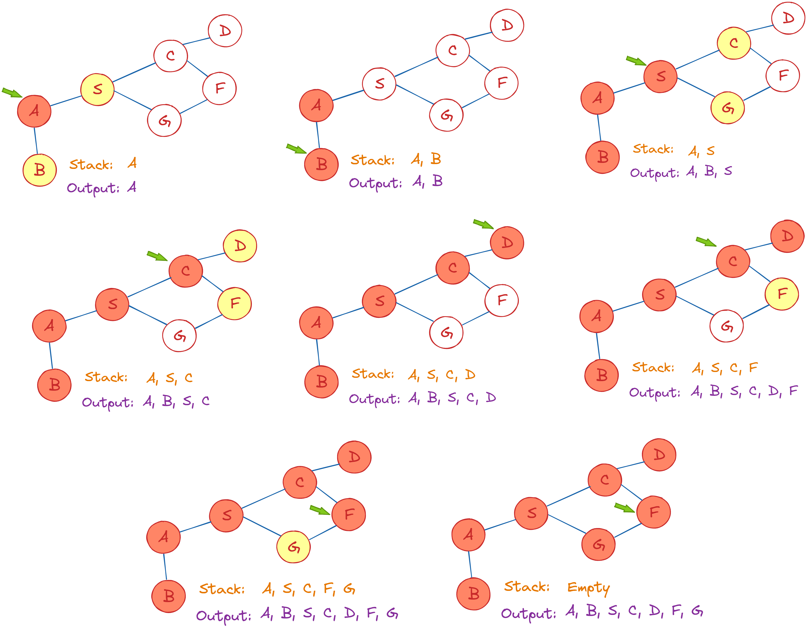
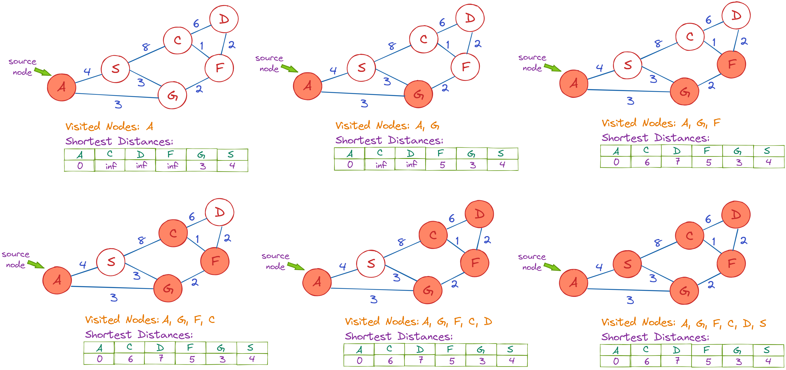
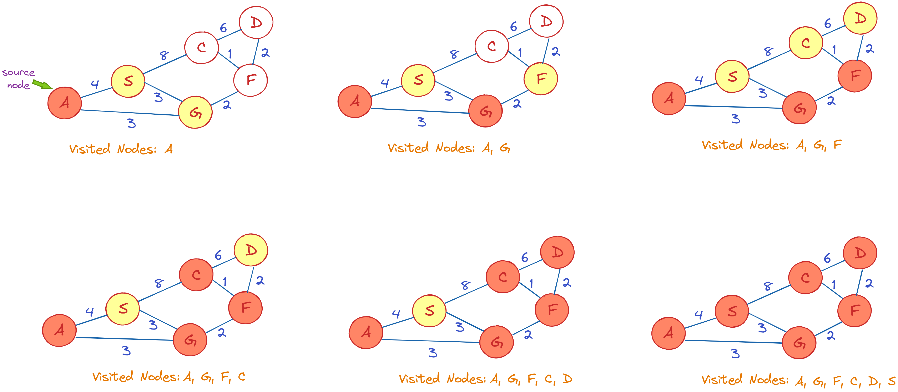
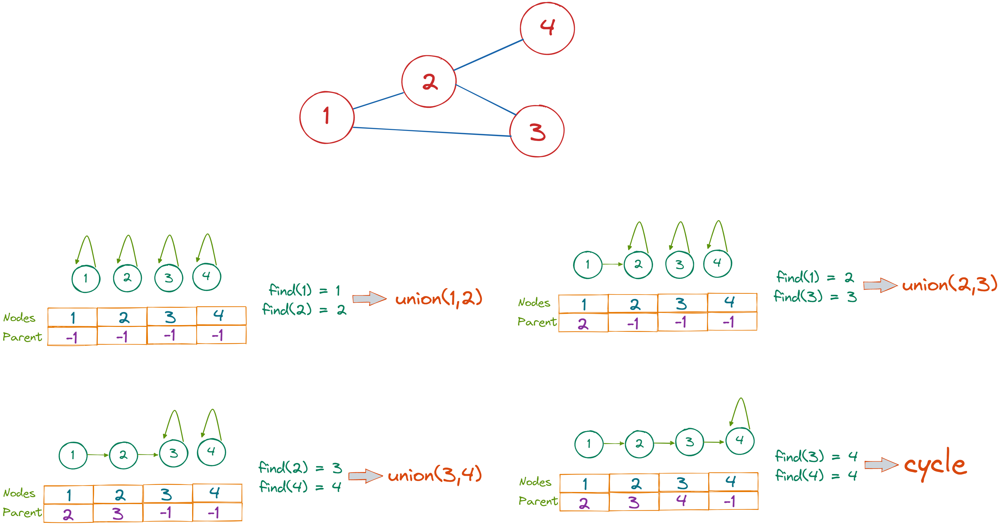
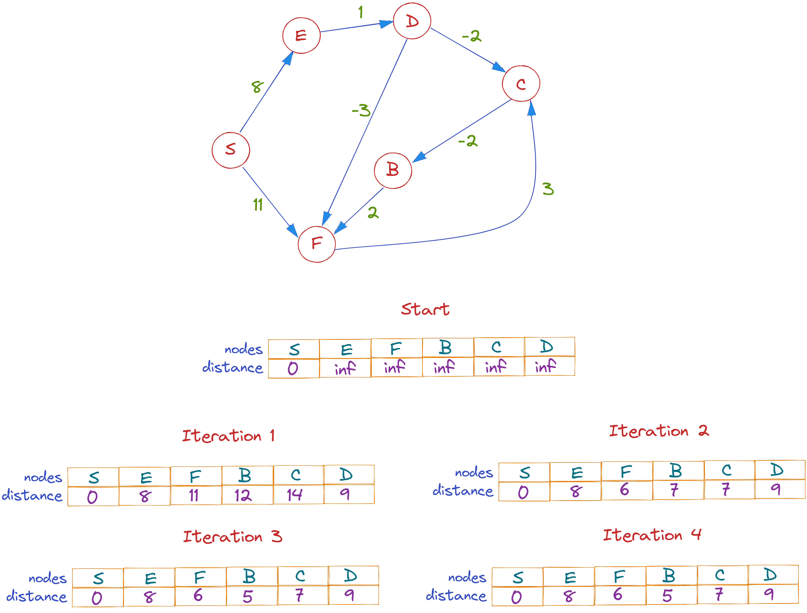

# Graph Theory: Basic Graph Algorithms Explained

# Introduction 

A **graph** is made up of a limited number of **vertices** or **nodes** and a set of edges that link them. When two vertices are connected by the same edge, they are said to be neighboring. In real-world settings such as social media networks, online pages and connections, and GPS locations and itineraries, _graphs have become a valuable tool for modeling and recording data._ A graph may be used to depict a collection of things that are connected to one another.

_A collection of instructions that traverses (visits nodes of a) graph is known as a **graph algorithm**_. To discover a specific node or the path between two nodes, different algorithms are utilized. In this tutorial, we’ll take a look at some of the most often used graph algorithms, such as: _breadth-first search, depth-first search, Dijkstra's shortest path, union–find, Prim’s, Bellman-Ford, and Floyd-Warshall._

# Breadth-First Search Algorithm

**Breadth-First Search (BFS)** is a graph traversal algorithm in which you start at a certain node and traverse the graph layer by layer, thereby examining the neighbors (nodes that are directly connected to starting node). _Once all neighboring nodes are traversed, you must go to the next-level neighbor nodes._

As the name implies, you must traverse the graph in a breadthwise direction:
1.	Begin by traveling horizontally and visiting all of the nodes in the current layer.
2.	Continue on to the next level.

_A graph might include cycles_, which can lead you back to the same node when traversing it. Use an array to indicate the node once it is treated to prevent processing it again. While visiting the nodes in a graph's layer, save them in a way that allows you to explore the associated child nodes in the same sequence. 

This algorithm is used by search engine crawlers to create web page indexes. Moreover, it is used for looking for information on social media sites and finding the shortest paths and minimum spanning trees.

# Depth-First Search Algorithm

**The Depth-First Search (DFS)** algorithm is used to traverse or explore data structures such as trees and graphs. The algorithm starts from the root node (which is any random node when traversing a graph) and examines each branch as far as possible before retracing. _So, the fundamental concept is to start at the root or any arbitrary node and mark it, then advance to the next unmarked node and repeat until there are no more unmarked nodes. Then go back and check for any more unmarked nodes to cross._ Finally, print the path's nodes. 

The DFS algorithm is useful for determining a route between two vertices, finding cycles, solving one-solution puzzles, and topological sorting.

# Dijkstra's Algorithm

The **shortest path** between a specific node and all other nodes in a graph may be determined by **Dijkstra's Algorithm.** _This approach finds the path that minimizes the overall distance (weight) between the source node and all other nodes by taking into account the weights of the edges._ The shortest path between two vertices is a path in the graph where the sum of the weights of the edges that are to be traveled is the smallest.

Dijkstra's algorithm keeps track of the shortest distance between each node and the source node, and it updates these values whenever a shorter path is discovered. When the algorithm has determined the shortest path between two nodes, that node is marked as "visited" and added to the path.

The method is repeated until the path covers all of the nodes in the graph. As a result, _we have a path that connects the source node to all other nodes, using the shortest route possible to each node._

In mapping software such as Google Maps or Apple Maps, this algorithm is used to discover routes from one point to another. Moreover, it is used in networking to address the minimum-delay path problem and in abstract machines to figure out the possible options for getting to a specific goal state by transitioning between different states. 

# Prim’s Algorithm

_**Prim's algorithm** is a greedy algorithm for determining the minimum spanning tree in an undirected weighted graph._ A graph's spanning tree connects all of its vertices with the fewest amount of edges possible. This tree is always connected and never has cycles. There are several spanning trees for the same graph. As a result, a minimum spanning tree is just the spanning tree with the lowest sum of edges (cost). _Prim's method performs best on dense, connected graphs._

Prim’s algorithm has various applications, such as: the traveling salesman problem, a network of roads and rail tracks connecting all of the cities, network of pipes for water or gas, and cluster analysis.

# Union–Find Algorithm

**The Union-Find Algorithm** (also known as the disjoint-set data structure) is an algorithm that keeps track of a set of items that have been partitioned or broken into a number of disjoint (non-overlapping) subsets. This approach assumes there are no self-loops in the graph and _can be used to determine whether or not an undirected graph has a cycle._

On its sets of object elements, the Union-Find algorithm conducts two actions - _Find_ and _Union_: 

- **Find**: Used to figure out which subset an element belongs to, or, more specifically, if two elements belong to the same subset. It addresses the issue of whether or not there is a path that connects two objects.
- **Union**: Used for combining two subsets into a single one. This is the real link between the two objects.

In the example below, we check if the given graph has a cycle or not. The idea behind it is that we make subsets of each edge using both of the edge's vertices. A cycle is identified when both vertices belong to the same subset. All slots in the parent array are initially set to -1, i.e. every subset contains only one item.

The Union-Find algorithm is commonly used in the following scenarios: grid percolation, network connectivity, Kruskal’s algorithm for finding the minimum spanning tree, etc.

# Bellman-Ford Algorithm

_**The Bellman-Ford Algorithm** determines the shortest pathways between a source node and all vertices in a graph. The primary difference between the Bellman-Ford and Dijkstra algorithms is that the Dijkstra algorithm does not work for graphs with negative weights, but the Bellman-Ford algorithm does._ However, it does not work for negative cycles. Bellman-Ford is also less complicated than Dijkstra and is well suited to distributed systems. However, Bellman-temporal Ford's complexity is O(VE), which is higher than Dijkstra's.

A very important application of this algorithm is in the distance-vector routing protocol. This protocol determines how data packets are routed over a network. The number of routers a path must pass through to reach its destination is determined by the distance equation (used to determine network weights).

## One Pager Cheat Sheet

- A **graph**, composed of **vertices** or **nodes** and connecting edges, serves as a valuable model for encoding data in various real-world situations, and **graph algorithms**, such as _breadth-first search, depth-first search, Dijkstra's shortest path, union–find, Prim’s, Bellman-Ford, and Floyd-Warshall_, provide instructions to traverse these graphs and locate specific nodes or pathways.
- The **Breadth-First Search (BFS)** is a `graph traversal algorithm` that starts from a given node and travels layer by layer, examining neighboring nodes before moving to the next level, making use of an `array` and a `queue` to manage visited nodes and pending exploration respectively, and is commonly used in creating web indexes, social media information search, and finding shortest paths and minimum spanning trees.
- The **Depth-First Search (DFS)** algorithm is a technique used to `explore` or `traverse` **data structures** like trees and graphs by starting from a root node, exploring as deep as possible before backtracking and is useful for **finding routes, determining cycles, solving puzzles, and topological sorting**.
- The **Depth-First Search (DFS) algorithm** applies the concept of `backtracking` by thoroughly exploring each **branch of the tree** or **graph** until it reaches a dead end or the goal, then **retracing its steps** to traverse a new, unexplored path, validating that "DFS implements the idea of backtracking" is **true**.
- **Dijkstra's Algorithm** is a method for determining the **shortest path** between one specific node and all other nodes in a graph, by continuously updating distances and marking nodes as visited, hence, it is widely used in mapping software and networking to solve minimum-delay path problems.
- **Dijkstra's Algorithm**, a `greedy algorithm`, suffers from the inability to handle **graphs with negative edge weights**, requiring the use of alternative approaches like the **Bellman-Ford algorithm** that can re-evaluate node distances and accommodate negative weights.
- **Prim's algorithm** is a **greedy algorithm** used to compute the `minimum spanning tree` in a `weighted graph`, often leveraged in applications such as the traveling salesman problem and various network modeling.
- The **minimum spanning tree** (MST) of a given graph yields a total weight of `12` by connecting all vertices using the **Prim's Algorithm**, which progressively adds the shortest edge possible between a vertex within the tree and one outside it.
- The **Union-Find Algorithm**, also known as the disjoint-set data structure, is a technique used to keep track of a partitioned set of elements, mainly used to determine cycles in an undirected graph by conducting two actions: `Find` (identifies the subset an element belongs to, and if two elements are in the same subset), and `Union` (combines two subsets into one).
- The **Union-Find Algorithm**, which uses a **disjoint-set data structure** and performs key operations: **`Find`** (checks if a `path` links elements) and **`Union`** (merges subsets), is effective for identifying cycles within a graph by determining if an edge's vertices belong to the same subset.
- The **Bellman-Ford Algorithm** is a method to find the **shortest pathways** between a source node and all vertices in a `graph`, unlike Dijkstra's algorithm, it can handle `graphs with negative weights` but not negative cycles; this algorithm's complexity is higher but is simpler and ideal for `distributed systems`, also being used in the **distance-vector routing protocol** for network data packet routing.
- The statement that the **Bellman-Ford algorithm** is a **greedy algorithm** is **false**, as it **doesn't always make the locally optimal choices** seen in a `greedy algorithm`, but instead **iterates over all edges** and keeps relaxing constraints to possibly find a **shorter path**, a distinct approach that even allows it to handle `negative edge weights`.