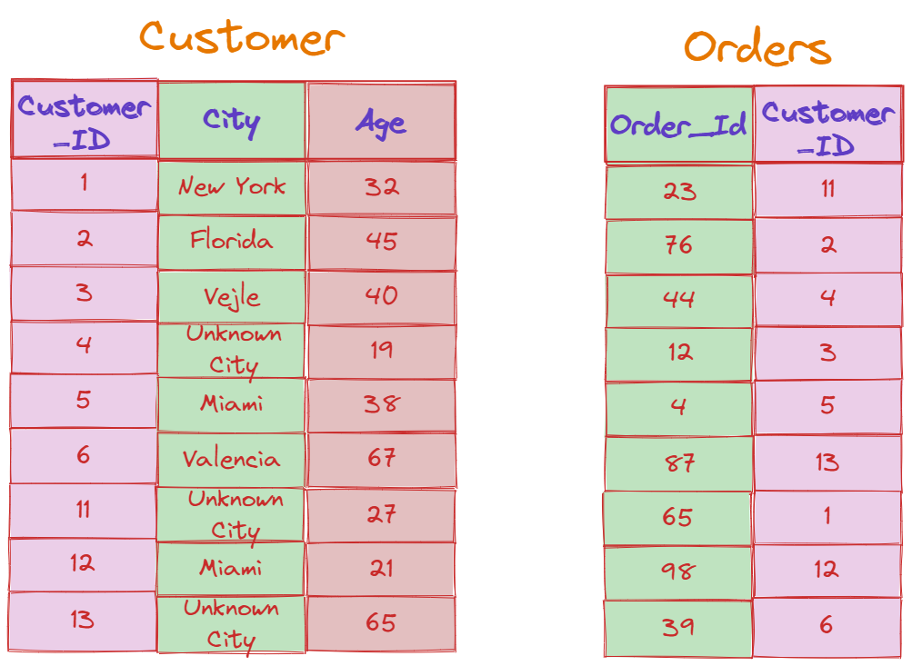

# Constraints in SQL


## Introduction

_**SQL constraints** are a collection of rules used on tables in relational databases to **limit the types of data that may be added, changed, or removed from those tables.**_ By doing this, _the information recorded in the table is guaranteed to be reliable and accurate._ After the constraint is set up, any database operation that doesn't adhere to the restrictions set forth by the constraint is terminated. We will discuss SQL constraints in this post, including what they are, the many types that are frequently used, how to apply them, and how to remove them. But first, let's quickly go through the main benefits of constraints.

## Why Do We Apply SQL Constraints to Tables?

The following is a list of the main reasons why SQL Constraints help us while creating and managing databases:
-	_Ensure that bad data is not added to important tables._
-	_Enforce business logic at the database level._
-	_Maintain relationship integrity between any number of tables._
-	_Boost the overall performance of the database._
-	_Important database rules are documented._
-	_Maintain uniqueness_

# NOT NULL Constraint

_A column may by default contain NULL values. Therefore, a NOT NULL constraint is utilized in order to solve this problem when necessary._ **This constraint states that there can never be a blank cell value for any row in this column.** Typically, this condition is applied to columns that store data that is _extremely necessary_ to locate and retrieve from a table. The NOT NULL constraint can be set up either when the table is first created or at a later time using a MODIFY statement.
Below, we can see the _syntax_ for declaring a NOT NULL Constraint on the _Customer_ID_ column during the creation of the table, named _Customer_:


```sql
CREATE TABLE Customer (
    Customer_Id int NOT NULL
);
```
The _int keyword_ stands for _integer_ – which means that the fields of this column only accept integer values. 
In case we had created the table without specifying the NOT NULL constraint and would like to add it at a later time, we can do this by using the _ALTER_ and _MODIFY keywords_, like so:


```sql
ALTER TABLE Customer
MODIFY Customer_Id int NOT NULL;
```

## UNIQUE Constraint

_The UNIQUE constraint states that no cell value in a column may be used more than once across the whole table_. To put it another way, **there can be no duplicate rows in this column of the table**. A guarantee for uniqueness for a column or set of columns is provided by the UNIQUE and PRIMARY KEY constraints.
Let us now create the same table as above, only this time let’s add another condition that the _Customer_Id has to be unique_, apart from not being null:
```sql
CREATE TABLE Customer (
    Customer_Id int NOT NULL UNIQUE
);
```
If we’d like to ALTER an already created table, we’d use the ADD keyword this time instead of the MODIFY one. Let’s take a look:
```sql
ALTER TABLE Customer
ADD Unique(Customer_Id);
```

## CHECK Constraint

**All the records in a particular column must adhere to a specified criterion**, and this is where the _CHECK constraint_ comes in. _This constraint is typically used to enforce business logic on values in a column, preventing the entry of inaccurate data_. The CHECK constraint may be specified either when the table is created or may be added later using an ALTER statement.
Imagine we add a column in our Costumer table which holds information about the customers’ age. Moreover, we’d like to make sure that all customers are over 18 years old. Then, we’d write the following _query_:
```sql
CREATE TABLE Customer (
    Customer_Id int NOT NULL UNIQUE,
    Age int,
    CHECK (Age>18)
);
```
To create a CHECK constraint on the Age column after the table has been created, we use the following syntax:
```sql
ALTER TABLE Customer (
ADD CHECK (Age>18)
);
```

## DEFAULT Constraint

_When a record's designated column is left empty, the DEFAULT constraint is used to establish a default value that must be entered_. **If no alternative value is provided, the default value will be appended to all new records**. The DEFAULT constraint can be set either when the table is created or at a later time via an ALTER statement.
In the following example, we create a column City and whenever a city regarding a specific customer is not specified, we add the default value, which in our case would be _Unknown City_. 
```sql
CREATE TABLE Customer (
    Customer_Id int NOT NULL UNIQUE,
    Age int,
    City varchar(255) DEFAULT ‘Unknown City’,
    CHECK (Age>18)
);
```

In case the table is already created, use the following query to create a DEFAULT constraint on the City column:
```sql
ALTER TABLE Customer (
ALTER City SET DEFAULT ‘Unknown City’;
);
```

## PRIMARY KEY Constraint

**PRIMARY KEYS serve as distinct identifiers for each row in a table**. _They can be values found in a table's single column or a combination of the table's several columns_. The PRIMARY KEY column needs to be _UNIQUE_ and _cannot be NULL_. The primary key in the table's value is a unique identifier for a specific row in the parent table that links the row to additional information present in the child table, where the same distinct identity also exists as a FOREIGN KEY. The PRIMARY KEY constraint can be set either when the table is created or at a later time using an alter statement.
The following _query_ creates a _PRIMARY KEY_ on the _Customer_Id_ column in the _Customer_ table.
```sql
CREATE TABLE Customer (
    Customer_Id int NOT NULL UNIQUE,
    Age int,
    City varchar(255) DEFAULT ‘Unknown City’,
    CHECK (Age>18)
);
```
If we’d like to add a PRIMARY KEY after the creation of the table, we’d have to run the following ALTER _statement_:

```sql
ALTER TABLE Customer (
ADD PRIMARY KEY (Customer_Id);
);
```

## FOREIGN KEY Constraint

**A foreign key is a field in a table that uniquely identifies each row of another table**. _A column (or set of columns) in one table that is the FOREIGN KEY relates to the PRIMARY KEY of another table_. The table with the _FOREIGN KEY_ is referred to as the child table, and the table with the _PRIMARY KEY_ is referred to as the parent table. The FOREIGN KEY constraint may be specified either at the time the table is created or may be added later via an alter statement.
Imagine we have a Customer table created with the constraints explained in the examples above, and another table called Orders, which keeps track of every order that has been made. These tables can be seen below:


The _Customer_Id_ is the PRIMARY KEY in the Customer Table. However, the _Customer_Id_ is a FOREIGN KEY in the Orders Table. 
In order to create the Orders table, we run the following _SQL query_:
```sql
CREATE TABLE Orders (
    Order_Id int NOT NULL UNIQUE,
    PRIMARY KEY (Order_Id),
    FOREIGN KEY (Customer_Id) REFERENCES Customer(Customer_Id)
);
```

In order to create a FOREIGN KEY in an already created table, use the following _syntax_:
```sql
ALTER TABLE Customer (
ADD FOREIGN KEY (Customer_Id) REFERENCES Customer(Customer_Id);
);
```

### One Pager Cheat Sheet

- _SQL **constraints** provide an important way to maintain the **reliability** and **accuracy** of data in relational databases, by limiting the types of data that may be added, changed, or removed from tables._
- Applying **SQL Constraints** to tables helps us to `enforce` business logic, maintain `relationship integrity`, `prevent bad data`, improve performance, and `ensure uniqueness`.
- `SQL Constraints` are used to guarantee **quality data**, restrict allowed data, enforce business logic, maintain relationships, ensure uniqueness, and improve performance, helping to guarantee **database rules** are followed.
- A **NOT NULL Constraint** is utilized to ensure that a column that stores important data will never contain a blank value.
- The UNIQUE constraint ensures that the values in the column it is specified for are unique and `cannot be repeated`.
- A **CHECK constraint** can be used to enforce business rules and restrict data entry, by specifying that all records in a database column must adhere to a specified criterion.
- The **DEFAULT constraint** establishes a `default value` that will be used if no alternative value is provided for a record's designated column.
- **A PRIMARY KEY is a unique identifier for a table's row which cannot be NULL, and it can be set either during the creation of the table or afterward with an ALTER statement.**
- A FOREIGN KEY is a field in a table that uniquely identifies each row of another table, which is specified either when the table is created with a `CREATE TABLE` query or with an `ALTER TABLE` query.
- A `primary key` ensures data consistency and accuracy while establishing relationships between tables, so having more than one would be **illogical**.