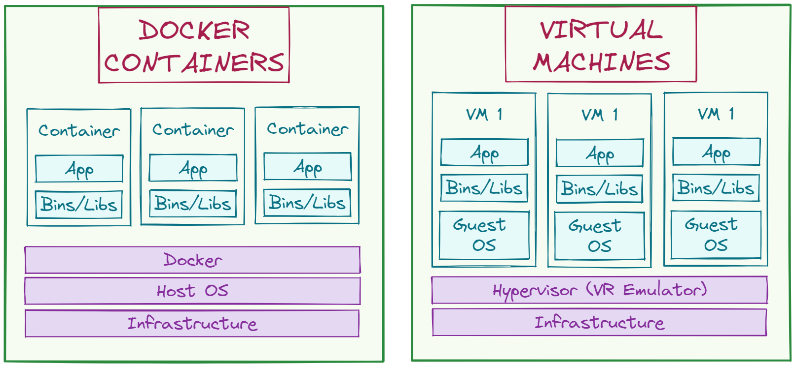
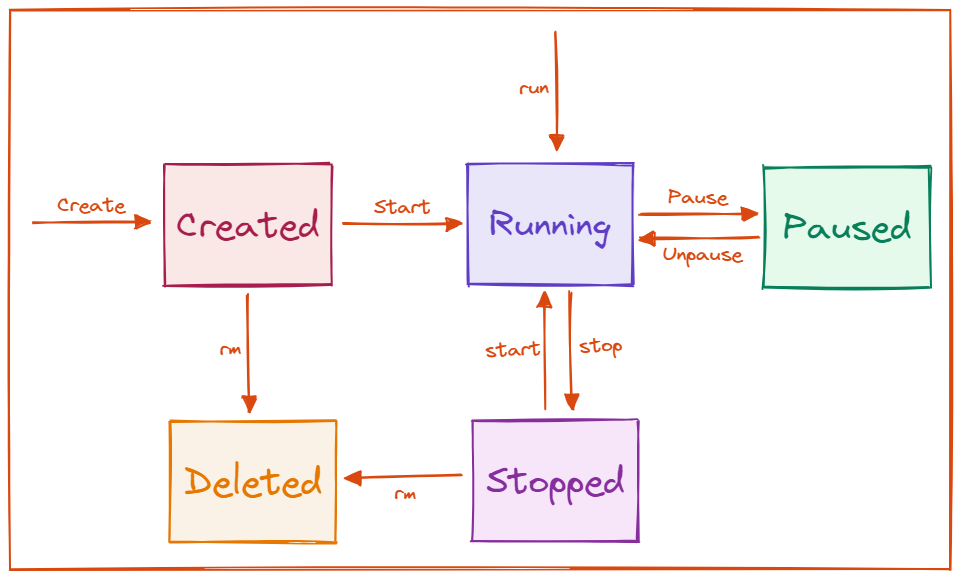

# Docker Interview Questions
 

## Introduction

As **Docker** continues to gain popularity as a _containerization tool for developing, deploying, and managing applications_, it's no surprise that it has become a hot topic in the tech industry. Docker has transformed the way developers build and deploy apps, making it easier to move code across different environments. As a result, many businesses are turning to this platform to help them streamline their processes due to its _portability, efficiency, consistency,_ and _security._

In this article, we will explore some common interview questions and provide you with the knowledge and confidence you need to succeed in your next Docker interview.

## What is Docker?

**Docker is an open-source, lightweight containerization technology platform that allows developers to package their applications and dependencies into portable containers**. These containers are separated from the underlying infrastructure and other containers, making them simple to move and deploy across development, testing, and production. 

Docker offers a _client-server architecture_ in which the _Docker client_ interacts with the _Docker daemon_, which controls the creation, deployment, and execution of containers. Developers may use Docker to locally create and test their apps before deploying them to a production environment with confidence that they will function as intended.

## What are the advantages and disadvantages of Docker?

Some of the most important _advantages_ of Docker include:

- **Portability** – as already mentioned, _Docker containers are extremely portable_ and can operate on any platform that supports Docker.
- **Efficiency** - _Docker containers have a smaller footprint than typical virtual machines_, allowing for faster deployment times and lower infrastructure costs.
- **Security** - _Docker adds layers of security by separating apps and their dependencies into distinct containers_. This can aid in the prevention of security breaches.
- **Consistency** - _Docker delivers consistency by guaranteeing that programs execute on consistent environments across various servers and development workstations_.
- **Collaboration** - _Docker makes it easier for developers to share their work environments and work together on projects_, which increases productivity and guarantees that everyone in the team is using the same codebase and dependencies.

On the other hand, some of Docker’s _disadvantages_ include:

- **Learning Curve** - _Docker has a steep learning curve for individuals new to containerization_, and it may take more time and resources to become adept.
-  **Complexity** - _Docker can increase complexity by requiring additional tools and skills for maintaining containers and coordinating containerized applications._
- **Dependency Management** - While Docker provides a solution for dependency management, _it may also create extra issues for maintaining dependencies across multiple containers and environments._
- **Compatibility Issues** - Docker may cause compatibility difficulties with current programs since _they may not be compatible with containerization or may require additional configuration to function in a containerized environment._

## What is a Docker container?

**A Docker container is a small, portable, self-contained package that contains everything required to run a program, including the application code, runtime, system tools, libraries, and settings**. _Docker containers are built using Docker images_, which are read-only templates that define the program and its dependencies. _Each Docker container is separated from the underlying infrastructure and other containers_, which means it has its own file system, network interfaces, and resource allocation. This isolation provides consistency and security, as containers can run on different environments without any modification. 

_In contrast to virtual machines (VMs), where virtualization takes place at the hardware level, containers virtualize at the app layer._ They can use a single machine, share its kernel, and virtualize the operating system to execute separate processes.

## What is a Docker image?

**A Docker image is an independent, executable package that is used for the construction of Docker containers** and contains everything needed to execute a piece of software, including its code, runtime, system tools, libraries, and settings. _Docker images are generated using a Dockerfile_, which is a script that describes the image's dependencies and parameters.

_Docker images are saved in registries like Docker Hub_, where they may be shared and downloaded by others. This enables developers to simply distribute and deploy their apps and services across several environments without worrying about underlying infrastructure or dependencies.

## What is a Dockerfile?

**A Dockerfile is a script that provides a series of instructions that must be followed in order to construct a Docker image.** Moreover, it includes instructions on how to install software, copy data, and configure the image. The _Dockerfile_ is used by the _Docker build command_ to generate a Docker image that can be used to construct and operate Docker containers.

## What are the Docker components?

Docker consists of _three components: Docker Client, Docker Host_, and _Docker Registry._

- **Docker Client** - _This component executes "build" and "run" operations_ in order to establish communication with the Docker host.
- **Docker Host** - _This component contains the primary Docker daemon, which connects to the Docker registry, and hosts containers and their related images_. 
- **Docker Registry** – _The Docker registry, which can be private or public, is where the Docker images are stored_. Docker Hub and Docker Cloud are the most well-known public registries.

## What is the difference between virtualization and containerization?

_Virtualization and containerization are both technologies used to create separate environments for executing programs_, but they vary in several significant aspects.

Some of their most significant _differences_ are shown in the _table below_.

## Explain the lifecycle of the Docker container

The docker container lifecycle refers to the _five phases_ it passes through from its creation through its termination:

-	**Created** – the container is in this state when it has just been created and has not yet been started
-	**Running** – all of the processes connected to the container would be active in this state
-	**Paused** – when the operating container has been paused, it enters this state
-	**Stopped** – when in this state, the running container has been terminated
-	**Deleted** – in this state, the container is no longer alive.

## List out some essential Docker commands

Some _important Docker commands_ are:

-	**Build** – used for building a Docker image
-	**Create** – used for creating a new container
-	**Dockerd** – used for launching the Docker daemon
-	**Info** – used for displaying information regarding the Docker Installation
-	**Kill** – used for killing a container

## What is the command for outputting all running containers in Docker?

The command for printing out all running Docker containers is: ` $ docker ps `

## What is the command for stopping a docker container?

The command for stopping a running Docker container is: ` $ sudo docker stop container name `

## One Pager Cheat Sheet

- This article provides common interview questions and insights on Docker, a containerization tool used for developing, deploying, and managing applications known for its portability, efficiency, consistency, and security.
- **Docker** is an open-source platform for **containerization**, allowing developers to package applications and dependencies into portable **containers** that can be easily moved and deployed across different environments, with a _client-server architecture_ that uses a **Docker client** to interact with the **Docker daemon**.
- **Docker containers** are not limited to running only Linux programs or executables, as Docker uses **containerization technology** to create a portable and isolated environment that can run various types of applications, including **Linux and Windows-based applications** with their dependencies, while offering a level of **abstraction** from the underlying infrastructure, and a **client-server architecture** that enables developers to create, run, and test applications on any platform before deploying them to production environments.
- The main advantages of **Docker include portability, efficiency, security, consistency, and collaboration** while its disadvantages are a **steep learning curve, increased complexity, dependency management challenges, and compatibility issues with existing programs**.
- **A Docker container is a self-contained package that contains everything required to run a program**, built using Docker images, and separated from the underlying infrastructure and other containers for consistency and security in different environments, which virtualizes at the app layer unlike virtual machines.
- A **Docker image** is an executable package for building **Docker containers** that has everything needed to run software, generated using a **Dockerfile** and saved in **registries** like Docker Hub for easy distribution and deployment.
- A **Dockerfile** is a script that gives instructions for building a **Docker image** with information on software installation, data copying, and configuration, used with the `Docker build command` to construct images for **Docker containers**.
- Docker has three components, including the Docker Client, Docker Host, and Docker Registry, with the Docker Client executing "build" and "run" operations to communicate with the Docker Host, which contains the primary Docker daemon and hosts containers and images, and images are stored in the Docker Registry, such as Docker Hub or Docker Cloud.
- Both **virtualization** and **containerization** create separate environments for executing programs, but they differ in terms of their implementation and resource utilization.
- The **lifecycle of a Docker container** involves five phases from creation to termination, including the **Created**, **Running**, **Paused**, **Stopped**, and **Deleted** states.
- A **Docker registry** is a central storage system for **Docker images** which serve as the foundation to create Docker containers and can be either public or private, hosted on-premises or in the cloud, with one of the most commonly used public registries being Docker Hub.
- The article lists essential Docker commands including Build, Create, Dockerd, Info, and Kill.
- When a Docker container is in a "Paused" state, all processes inside the container have been paused and it can only transition to the stopped state after being `resumed` with the `unpause` command.
- The `docker ps` command outputs all running containers in Docker.
- The `sudo docker stop` command stops a running Docker container by specifying the container name.
- The `Docker daemon` is responsible for managing `Docker` containers and images, initialized and started using the `dockerd` command, which requires `root privileges` and may need to be configured as a service for automatic startup.