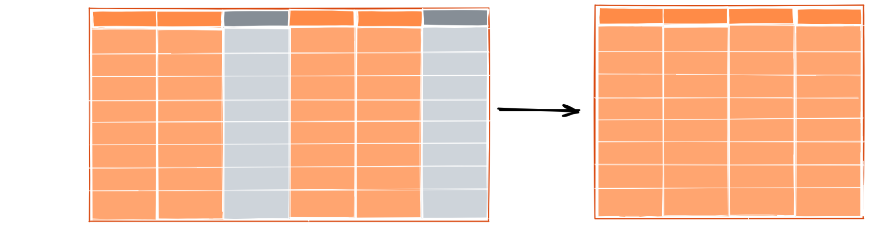
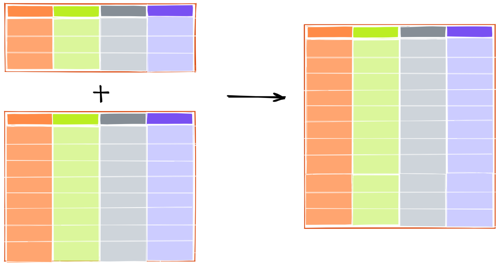

# Pandas Cheat Sheet

The term **Data Science** has been coined in 2001, and this relatively new field’s popularity and acceptability have grown over time as a result of its ability to assist organizations of all sizes to uncover patterns in data, allowing them to explore new markets, control expenses, improve operational efficiency, and gain a competitive edge. As a matter of fact, a recent study shows that _47 percent of the surveyed companies have noticed a significant change in the way they compete on the market as a result of data analytics utilization_, while around _62 percent of retail companies say it has provided a competitive advantage_. 

Around _75% of the data scientists say they frequently use **python**_ – an open-source, object-oriented, interactive, and portable programming language that is easy-to-use, mostly due to its simple syntax. There exist various libraries within the Python framework, one of which is _**pandas**_ – a fast, efficient, and flexible data manipulation and analysis tool. Pandas is a must-know library for anyone who is in the data science field, from beginners to professionals. 
Let’s take a look at some of its most commonly used functions.

## Import pandas

Before doing anything else, we have to import the library

        import pandas as pd

## Create a DataFrame 
	There exist different ways for this:
- **DataFrame from list of lists**
data = [[‘Germany’, ‘Berlin’], ['Austria', ‘Vienna’], ['Italy', ‘Rome’]]
  
        df = pd.DataFrame(data, columns = ['Country', ‘City’])

- **DataFrame from a dictionary**

        data = {‘Country’:['Germany', 'Austria', 'Italy'],
                'City':[‘Berlin’, ‘Vienna’, ‘Rome’]}
        df = pd.DataFrame(data)

  
- **DataFrame from list of dictionaries**

        data = [{‘Country’: ‘Germany’, ‘City’: ‘Berlin’},
                {‘Country’: ‘Austria’, ‘City’: ‘Vienna’}, 
                {‘Country’: ‘Italy’, ‘City’: ‘Rome’}]
	df = pd.DataFrame(data)

_All of the abovementioned examples ultimately create the same DataFrame._

## Read and Write

The next step would be to get the data and know how to export it. For this, we should take a look at some commands for reading a file and creating a DataFrame object from it, as well as saving a DataFrame in a specific format

- **Read and Write to Excel**

        pd.read_excel('data_file.xlsx')
        df.to_excel(‘directory_path/file_name.xlsx')

- **Read and Write to CSV**

        pd.read_csv('data_file.csv’)
        df.to_csv(directory_path/file_name.csv')

## Get specific rows
Very often, we’ll need to get only predefined rows from the database, or the first/last n rows. 
	
- **Extract the rows from the DataFrame that that satisfy a certain condition**

        df[df.Length == 5]

- **Get first 20 rows**

        df.head(6)

- **Get last n rows**

        df.tail(n)

- **Get a specific portion of the dataset**
        
        df.iloc[5:10]

- **Randomly get a fraction of rows**

        df.sample(frac=0.5)

## Get specific columns

Moreover, we might want to extract a subset of the DataFrame by taking only specific columns.
- **Extract only the columns with specific names from the database**

        df[[‘name’, ‘age’, ‘sex’]]

- **Get only one column with  a specific name**

        df.name

- **Get columns with specific positions**

        df.iloc[:, [1,2,6]]

- **Get columns whose name matches a regex**

        df.filter(regex=’regex_expression’)

## Concatenate two DataFrames

Not always the data we get is nicely structured and contains all needed information. Sometimes, we might have to merge two or more distinct datasets in order to get the required features for our problem of interest.

- **Append rows of one DataFrame to the other**

        pd.concat([df1, df2])

- **Append columns of one DataFeame to the other**

        pd.concat([df1, df2], axis = 1)

## Inspect a DataFrame

Understanding the data by inspecting it lets us know what should we do with it next, i.e. how to clean and preprocess it. 
- **Get the shape of the database** (number of rows and columns)

        df.shape

- **Get index, datatype, and memory info**

        df.info()

- **Get important statistics for columns with numerical values**

        df.describe()

- **View unique values and counts for the entire database** (all columns)

        df.apply(pd.series.value_counts)

## Clean a DataFrame

Cleaning the DataFrame is of the utmost importance – we might have the best models and utilize the latest tools and techniques, if the data we’re working with is bad, the results would be worthless and uninformative as well. 

- **Drop all rows that contain null values**

        df.dropna()
- **Drop all columns that contain null values**

        df.dropna(axis = 1)

- **Drop all duplicates**

        df.drop_duplicates(inplace=True)

- **Replace all null values with a given value** (in our case, with 1)

        df.fillna(1)
- **Rename columns**

        df.columns = [‘name_1’, ‘name_2’, ‘name_3’]

## Basic Statistics

We can also analyze the data by calculating some basic useful statistics.
- **Calculate the mean of all columns**

        df.mean()
- **Calculate the median of each column**

        df.median()
- **Calculate the standard deviation of each column**

        
        df.std()
- **Calculate the correlation between the columns in the DataFrame**

        df.corr()

- **Get the lowest value in each column**

        df.min()
- **Get the highest value in each column**

        df.max()

## Grouping
Sometimes, we want to group only a subset of columns and perform some calculations or mathematical operations.
- **Get an DataFrameGroupBy object containing values from a specific column**

        df.groupby(col)

- **Get an DataFrameGroupBy object containing values from multiple columns**

        df.groupby([col1,col2])

- **Get the mean of the values in column_2, grouped by the values that are in column_1**

        df.groupby(column_1)[column_2] 

## Get Memory Usage

This command returns a Pandas Series object where we have the memory usage of each individual column inside the DataFrame. This can be very beneficial for solving _MemoryError_ errors in Python.

        df.memory_usage(deep=True)

## Convert to DateTime

When working with data that has time series or dates, this method comes in handy. It can convert any object of type integer, float, list, Pandas Series, or Pandas DataFrame to a _datetime format_.

        df['column_name'] = pd.to_datetime(df[‘column_name’])

In this tutorial, we covered some of the principal functions that can get you started with a data science project. Pandas, however, has countless other methods that allow us to examine, preprocess, and understand the data we are working with, and that is the reason why this library is so popular and widely utilized amongst data scientists nowadays.

