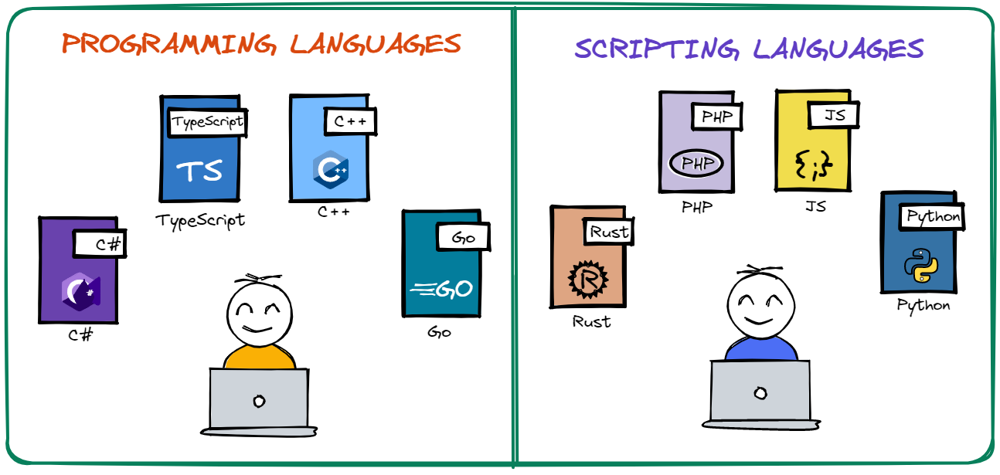
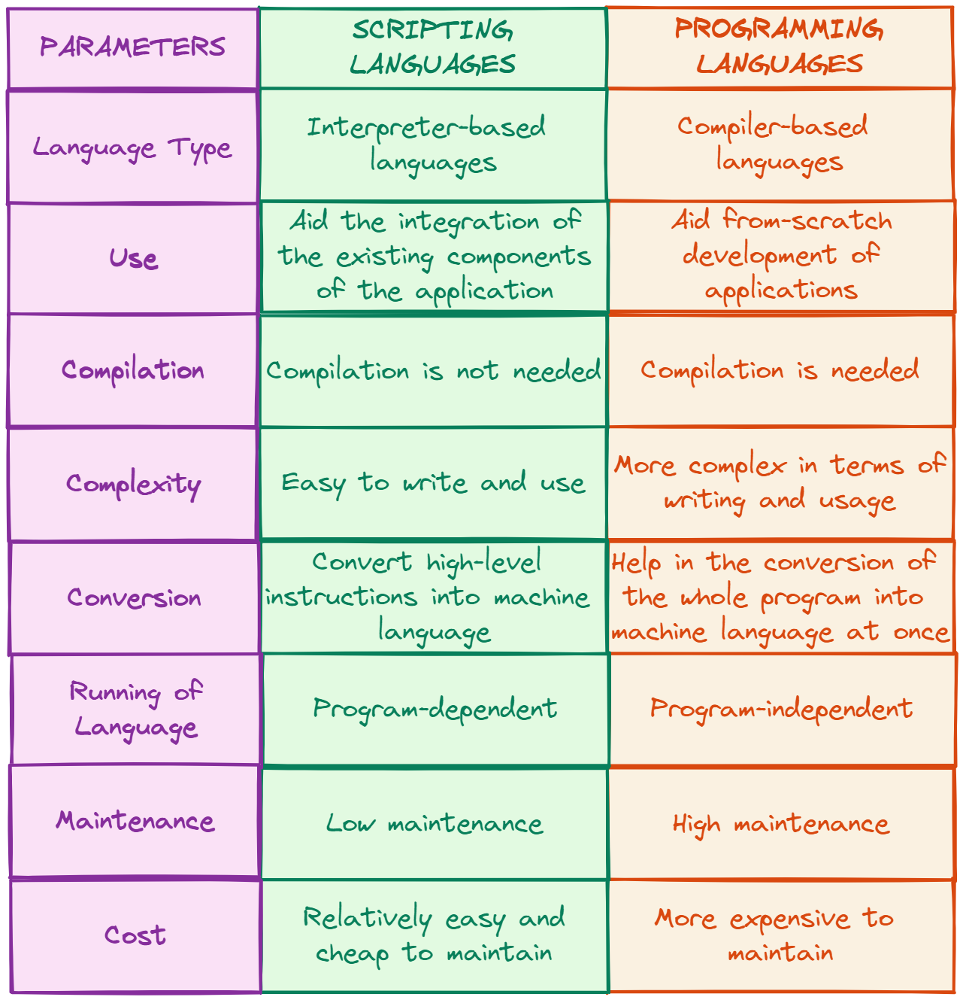

# Scripting Languages vs Programming Languages

## Introduction

Quite often, the terms **scripting language** and **programming language** are used interchangeably. However, this is wrong as, _apart from the fact that both languages are used in the software development field, these two terms are very different from each other._ 

One important thing to note is that _all scripting languages can be used as programming languages, but the opposite is not true._ Moreover, _the scripting languages are interpreted and do not require compilation, but the programming ones do._

Let’s learn a bit more about both scripting and programming languages, their key features, and their differences.

## Scripting Languages

_A programming language created especially for runtime environments is known as a **scripting language**_. Scripting languages facilitate the automation of many software programs, browser web pages, OS (operating system) shell usage, etc.** Scripting languages are typically interpreted, rather than compiled**, which means that they do not need to be compiled into machine code before they can be run. There are numerous available scripting languages, some of which are _Python, Ruby_, and _JavaScript_, and each one of those languages comes with a special set of features and capabilities. 

Generally speaking, _there exist two types of scripting languages:_

- **Server-side scripting languages**: they are used to _create dynamic web content on the server_. These languages are executed on the server, and the resulting web page is then sent to the client's web browser. Examples of server-side scripting languages include _PHP, Ruby_, and _Python_.

- **Client-side scripting languages**: they are used to _create dynamic web content in the client's web browser_. These languages are executed on the client's computer, rather than on the server. Examples of client-side scripting languages include _JavaScript_ and _ActionScript_.

### Main Features of the Scripting Languages

Scripting languages have a number of **key features** that make them well-suited for a variety of tasks, including _automation, web development_, and _data analysis_.

One of the key features of scripting languages is their **simplicity**. These languages are _designed to be easy to learn and use, with a syntax that is often more readable and intuitive than more complex programming languages_. This makes them a good choice for beginners and for tasks that do not require the full power of a more complex language.

Another key feature of scripting languages is their **flexibility**. _Since they are interpreted, rather than compiled, they can be easily modified and tested without the need for recompilation._ This makes them a good choice for tasks that require rapid prototyping or iteration, as well as for tasks that may require frequent updates or changes.

Scripting languages are also often well-suited for tasks that involve **data manipulation** and **analysis**. Many of these languages _have built-in support for common data structures and algorithms_, as well as _libraries_ and _frameworks_ that make it easy to work with data in a variety of formats.

Finally, scripting languages are often used for **web development**, _due to their simplicity and flexibility_. Many of these languages have libraries and frameworks that make it easy to build web applications and interfaces, and they are often integrated with other tools and technologies used in web development, such as databases and servers.

## Programming Languages

_A **programming language** is a formal language that is used to write instructions that can be executed by a computer._ These instructions, also known as code, are used to create programs that perform specific tasks or solve specific problems. There are many different programming languages available, with the most popular ones being _C, C++_, and _Java_, among others.

_Programming languages are designed to be precise and concise_, making them easy for humans to read and write, but also easy for computers to understand and execute. To do this, _they use a set of predefined rules, called syntax, that dictate how the code should be written_. **These languages are typically compiled** , which means that they are translated into machine code that can be directly executed by the computer. The compilation process can take some time, as it involves converting the entire program into machine code before it can be run. 

_Programming languages are classified into different categories, based on the level of abstraction from the hardware and the type of tasks they are most suitable for._ These categories include _low-level languages_, such as assembly and machine code, which are closer to the hardware and are used for tasks that require fine-grained control over the hardware; and _high-level languages_, such as C++ and Java, which are further from the hardware and are used for more abstract tasks.

### Main Features of the Programming Languages

Programming languages have several _key characteristics_ that make them suitable for a wide range of tasks, including _software development_ and _system administration_.

One of the key features of programming languages is their **simplicity** _since the majority of modern languages have simple learning curves._ Usually, there is a trade-off between a language's speed and abstraction and its simplicity.

Another important feature is their **structure** – they all have a specific structure that includes things like _predefined syntax, semantics, a list of rules_, etc.

Programming languages have also a **high level of abstraction**, which is the _capacity of hiding complex features that the users may not need to know_. This characteristic is one of the most significant and fundamental ones in all object-oriented programming languages.

Moreover, programming languages are **efficient**, meaning that they are _translated and executed quickly_ to prevent requiring excessive amounts of memory or taking too much time. Last but not least, they are **portable**, meaning that it is relatively _easy to move them from one computer to another._

## Differences between Scripting Languages and Programming Languages

Overall, _the main difference between programming languages and scripting languages is the way in which they are executed and the level of abstraction from the hardware._ Both types of languages have their own unique set of features and capabilities, and the best language to use will depend on the specific needs of the task at hand. A more granular view of their differences, however, is shown in the _table below_. 

### One Pager Cheat Sheet

- Though a **scripting language** and a **programming language** may appear to be interchangeable, `interpreted` scripting languages and `compiled` programming languages have significantly different features.
- **Scripting languages are typically interpreted programming languages used to automate software, web pages and shell usage, such as `Python`, `Ruby`, `JavaScript`, `PHP`, `ActionScript`, etc., and can be divided into `server-side` and `client-side` scripting languages.**
- C# is a `general-purpose, type-safe, object-oriented programming language` developed by Microsoft which requires compilation prior to execution, and is typically used for developing Windows, Web, and mobile applications.
- Scripting languages are designed for **flexibility and simplicity**, and are **well-suited** for tasks such as automation, web development, data manipulation and analysis.
- Scripting languages are `dynamically typed` and `interpreted`, while programming languages are `statically typed` and `compiled`, and are used for different purposes and tasks.
- Programming languages are designed to be precise and concise and use a set of predefined rules, called syntax, that dictate how the code should be written, which is then **compiled** into machine code for direct execution by the computer.
- Programming languages are **simple**, **structured**, have **high levels of abstraction**, are **efficient**, and **portable**, making them suitable for software development and system administration.
- All programming languages are **not scripting languages**, as general-purpose languages offer more `flexibility and control` and allow developers to create more `robust` and `scalable` applications with features such as `object-oriented development`, `data structures`, and `algorithms`.
- _The main difference between **programming languages** and **scripting languages** is their execution and level of abstraction from the `hardware`._