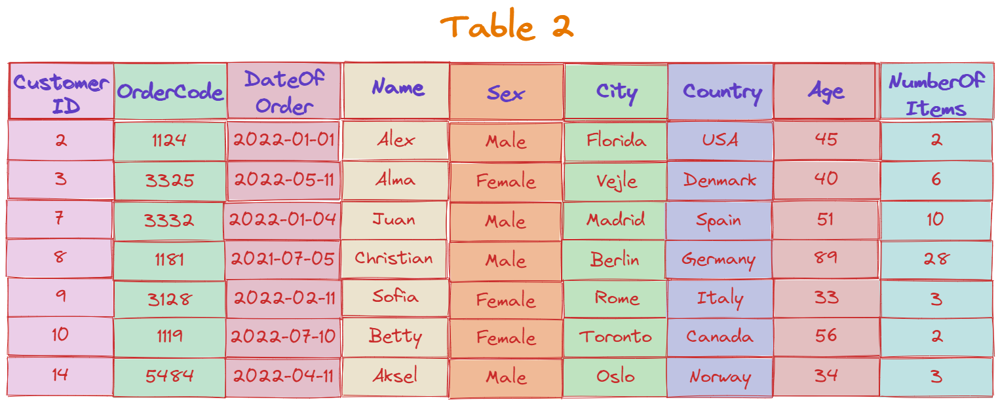
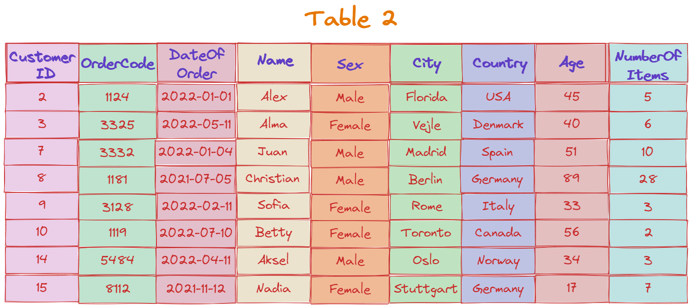

# Transactions in SQL


## Introduction

_A collection of one or more SQL statements that communicate with a database is known as a **SQL transaction**_. A transaction on a table is, for instance, when a record is _added_ to, _updated_, or _deleted_ from it. Transactions in SQL are _crucial for preserving database integrity_ in cases of concurrent execution of multiple related operations or concurrent interactions with the database. Every transaction starts with a particular task and finishes when every task in the group is successfully completed. **A single task failure causes the entire transaction to fail**. A transaction can therefore only have one of two outcomes: _success_ or _failure._

## Properties of SQL Transactions

By definition, a database transaction needs to be _atomic, consistent, isolated,_ and _durable_. The abbreviation These are frequently referred to as **ACID properties**.

-	_Atomicity_ – This property _guarantees the successful completion of all tasks_ inside the work unit. So, in case any task fails, all prior operations are rolled back to their initial states and the transaction is aborted at the point of failure.
-	_Consistency_ – This property makes sure that after a successful committed transaction, the _database's states are changed_ appropriately.  
-	_Isolation_ – This property allows transactions to _function transparently and independently_ of one another.
-	_Durability_ – This property makes sure that a committed transaction's outcome or impact _endures in the event of a system malfunction_.

## Transaction Control

The commands used to _manage transactions_ are as follows:

-	_BEGIN TRANSACTION_ – This command marks the _start of each transaction_.
-	_COMMIT_ – This command _saves the changes to the database_ in a permanent manner. 
-	_ROLLBACK_ – This command _reverses any modifications_, returning them to their original condition.
-	_SAVEPOINT_ – this command enables us to _roll back transactions in parts_ rather than all at once by establishing points within groups of transactions.
-	_RELEASE SAVEPOINT_ – This command is used to delete an existing SAVEPOINT.
-	_SET TRANSACTION_ – This command gives us the ability to give a transaction a name and specify whether we want it to be read-only, read/write, or to belong to a certain rollback segment.

## Examples of Transactions

For the next two _examples_ of SQL transactions, we will use the _following table:_


### Commit Example

So, the _steps and commands_ we should follow and write _when creating a COMMIT Transaction_ are:
1.	**BEGIN TRANSACTION** to start the transaction
2.	Various SQL statements such as **INSERT, UPDATE**…
3.	**COMMIT** command to finish the transaction and save the changes. 

Take a look at the following _example_ where we _insert a new order_ in the table shown above and we also _update the number of items ordered of an already existing order_ in the database:

```sql
-- Start the transaction    
BEGIN TRANSACTION  
-- SQL Statements  
 INSERT INTO Table2 VALUES(15, 8112, 2021-11-12, ‘Nadia’, ‘Female’, Stuttgart, Germany, 17, 7)  
 UPDATE Table2 SET NumberOfItems = 5 WHERE CustomerID = 2  
 -- Commit changes   
COMMIT TRANSACTION  
```
_The INSERT and UPDATE statements cannot be reverted back once the transaction has been committed._ If there are no errors, we will see the resulting table shown below, with each transaction's SQL query having been individually executed:




### Rollback Example

All changes have to be stopped immediately if an error with any of the SQL-grouped statements occurs. _Rollback refers to this action of undoing changes_ in such scenarios. Any transactions that haven't been recorded to the database yet will be rolled back using the ROLLBACK command, allowing us to start from the beginning of the transaction. _Only actions taken after the last COMMIT or ROLLBACK command can be reversed with this command._ 

For example, let’s write a transaction for _deleting all orders where the customer’s age is over 40_, and then undo the changes, like so:

```sql
-- Start the new transaction    
BEGIN TRANSACTION  
-- SQL Statements  
 DELETE FROM Table2 WHERE Age > 40
 -- undo changes   
ROLLBACK TRANSACTION  
```
_After the execution of the transaction, the resulting table would look exactly the same as before, because we rolled back the changes._

## One Pager Cheat Sheet

- **A SQL transaction is a collection of one or more SQL statements that communicate with a database, typically used for preserving database integrity in cases of concurrent execution of multiple related operations or interactions.**
- By **guaranteeing atomicity**, ensuring consistency, allowing for isolation, and providing durability, `SQL Transactions` uphold the `ACID` properties.
- Atomicity is a ACID property that ensures that a transaction is `either fully committed or not at all`, preventing any `inconsistent data` from being stored in the database.
- The `transaction control` commands `BEGIN TRANSACTION`, `COMMIT`, `ROLLBACK`, `SAVEPOINT`, `RELEASE SAVEPOINT` and `SET TRANSACTION` are used to **manage**, **save**, **reverse** and **name** **transactions**.
- We will `perform two SQL transactions` on the **table shown** to **illustrate examples** of transactions.
- By running a **BEGIN TRANSACTION**, entering various SQL statements such as **INSERT**, **UPDATE** commands and then **COMMIT TRANSACTION**, all the changes will be saved to the database and cannot be reverted back.
- All changes during a SQL transaction are undone using the `ROLLBACK` command, so that the resulting table looks **exactly the same as before**.
- The only way to recover the database to its previous state after a `COMMIT` statement is executed is by executing a `ROLLBACK` command, however this will only reverse actions taken after the last COMMIT or ROLLBACK command.