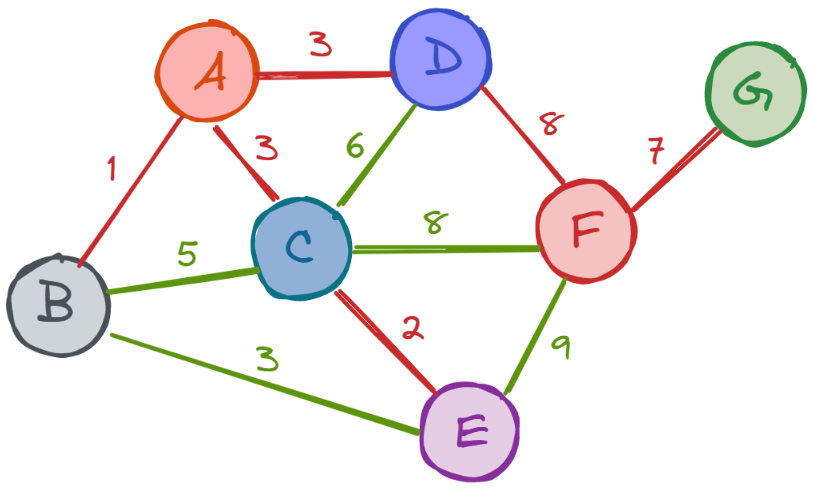

# Understanding Prim's Algorithm

**Prim’s algorithm** was discovered by Vojtěch Jarník in 1930, and then republished in the 1950’s - first by Robert C. Prim, and then by Edsger W. Dijkstra. It is a _greedy algorithm_ used for finding the _minimum spanning tree_ for an _undirected weighted graph_. In order to understand this definition, let us first go through the _terminology_ used in it:

**Greedy Algorithm** – it is a straightforward algorithm that tries to find the best solution by making the best possible decision with the most immediate benefit at each step. In other words, it works by making _locally-optimal choices_ in order to eventually get to a globally-optimal solution.

**Minimum Spanning Tree _(MST)_** – a spanning tree of a graph connects all the vertices of a graph with the least number of edges possible. As such, this tree is always connected and never contains cycles. For a single graph, there exist multiple spanning trees. So, a minimum spanning tree is simply the _spanning tree in which the sum of the edges (the cost) is the lowest_.

**Undirected Weighted Graph** – an undirected graph is a collection of nodes called _vertices (V)_ and links between them called _edges (E)_. When we say that a graph is weighted, that means that there is a number associated with each edge that represents its weight.

Prim’s algorithm works best on connected, dense graphs. In the case of disconnected graphs, this algorithm might not be the best one to use, because, in order to find the minimum spanning forest, it must iterate over each connected component of the graph individually. A _forest_ is a collection consisting of _many separate trees_.

The **time complexity** of the algorithm is **O((V+E)*log(V))**.

## The Algorithm 

Now, let’s see an example of the algorithm – with a _step-by-step explanation_. The graph for which we’ll find the minimum spanning tree is shown in the figure below. 
 

**In each iteration, we’ll keep a list of all visited nodes so that we can keep track of which nodes are yet to be traversed**.

 So, let’s begin.

## Step 1. Remove any Loops and Parallel Edges

In the first step, we ‘clean’ the graph by **removing all the loops, as well as all parallel edges that might exist**. If the parallel edges are of different weight, keep the one with the **lowest** weight.

`Visited = {}`

## Step 2 - Choose the Root Node

**This may be any arbitrary node** – there’s no rule as to how to choose the starting node of the algorithm. The idea is that, since the graph is connected, there is a link to every single node in the graph and thus, the algorithm will reach all nodes no matter the starting point. In our example, _we chose A as a root node_.
 

`Visited = {A}`

## Step 3. Select Edges with Least Cost

This is basically the _last step of the algorithm that is repeated until all nodes have been visited_. Here, since Prim’s is a greedy algorithm, we are always going to choose the edge with the **smallest weight** that connects to an unvisited node. 

In the graph below, the edges that connect A with the unvisited vertices B, C, and D are colored with blue color.

**Since the edge leading to B has the smallest weight, we visit B next.**

Now, `Visited = {A, B}`.

**The red edges are the ones we have already traversed.**

We repeat the same thing as before, only this time, we take into consideration all edges that connect _either_ A or B to an unvisited vertex.

Very often, there will be _more than one edge with the same minimal weight_. Such a thing happened in our example, where all A-D, A-C, and B-E edges have a weight of 3. In such a scenario, _we can choose whichever edge we like_. Here, we chose the A-C edge, and thus – the node C. 

Let’s add C to the list of visited nodes: `Visited = {A,B,C}`

Now, we have 5 traversable edges which lead from already visited to unvisited nodes. Out of them, the C-E edge has the lowest cost, so we visit E from C next.

`Visited = {A, B, C, E}`.

Out of the four possibilities, the best option is to visit **D** from A, since the weight is only 3. 

`Visited = {A, B, C, E, D}`.

Notice how, from all untraversed edges, the edge B-E has the smallest cost of 3. However, since both B and E are already in the MST, so we do not pick it. Remember, the only possible edges are the ones that are blue. Now, we can choose either C-F or D-F, since both have a weight of 8, so we choose D-F and we add **F** to the list of visited nodes.
 

`Visited = {A, B, C, E, D, F}`.

The only remaining unvisited node is **G**, so we add this to the MST.

_The final list of visited nodes looks like this: `visited = {A, B, C, E, D, F, G}`.

Now, all the nodes are connected in the tree. _Note that in our example, there existed several different ways to create the tree since, at some steps, we had to choose between two or more edges that had the same minimal weight_. Had we chosen another node, the list of visited nodes, and thus the MST, would have been different. _In cases where the edge weights are distinct, this tree would be unique_. 

Below, we can see the result – our minimum spanning tree created by using Prim’s algorithm.

_We can calculate the **total edge weight** of the tree by simply adding all the weights_:

**Total Edge Weight = 1+3+2+3+8+7 = 24**.

## Applications 

Prim’s algorithm finds many _applications_ within our everyday lives:

-	Road network and rail tracks
-	Network of pipes for water or gas
-	TV network
-	Development of games
-	Cluster analysis
-	Travelling Salesmen Problem

## One Pager Cheat Sheet

- This lesson will deep-dive into Prim's algorithm, which is a **greedy algorithm** used to find the **minimum spanning tree** for an **undirected weighted graph** with a time complexity of **O((V+E)*log(V))**.
- Yes, there can be multiple `minimum spanning trees` with different `costs` for a single graph, each having different combinations of edges connecting its vertices.
- We `traverse` the `graph` by keeping a list of all `visited nodes` to build a `Minimum Spanning Tree`.
- We `clean` the graph by **removing all loops and parallel edges**, keeping the one with the **lowest weight** if they differ.
- **We arbitrarily chose 'A' as the root node, which initiated a set of 'Visited' nodes containing only 'A'**
- We can select any `root node` **randomly** when using Prim's Algorithm as it guarantees that all nodes in the graph will eventually be visited and connected.
- In Prim's Algorithm, the last step is to repeatedly select the **smallest weight** edge that connects to an unvisited node until all nodes have been visited.
- From amongst the edges of the graph connecting `unvisited` vertices to node **A**, the **smallest weight** edge is selected, which leads to visiting node **C**.
- Prim's algorithm is a `greedy algorithm` used to find the `minimum spanning tree` of a graph, by starting at a root node and progressively adding the edge with the lowest weight until all nodes are visited.
- Prim's algorithm has a wide range of `applications` in **road networks**, **TV networks**, **cluster analysis**, **game development**, **piping systems**, and the **Travelling Salesmen Problem**.
- The algorithm `traverses` a graph using an adjacency matrix and `returns` a list of the nodes in the same order as they were `traversed`, with nodes labeled as numbers starting from 0 and a dictionary to `convert` numbers to letters if needed.